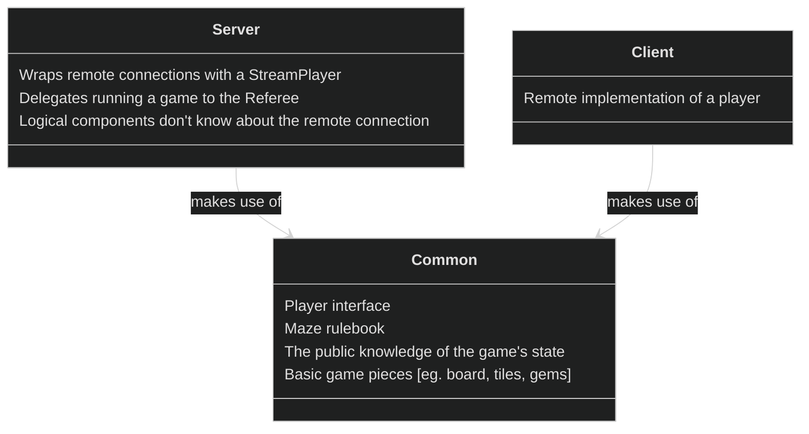
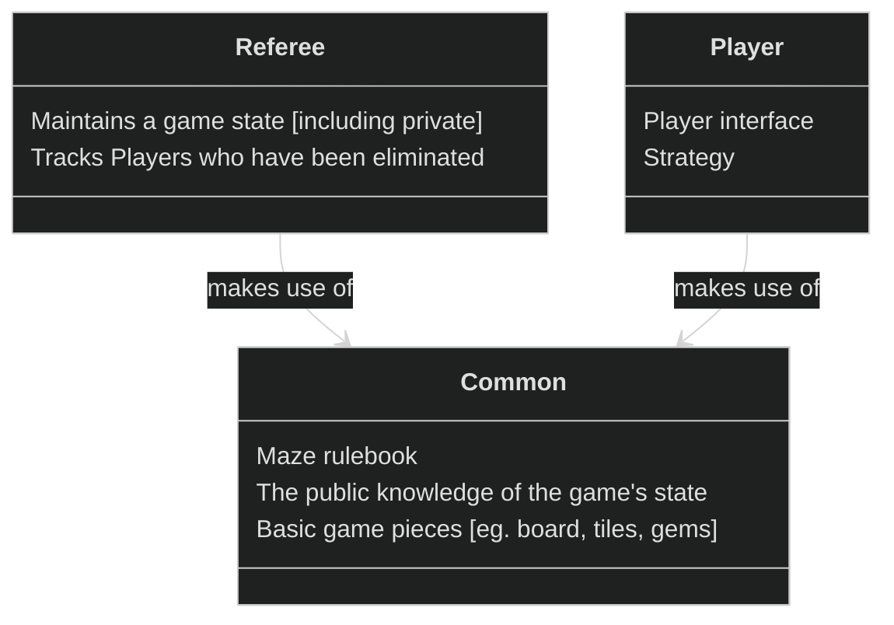
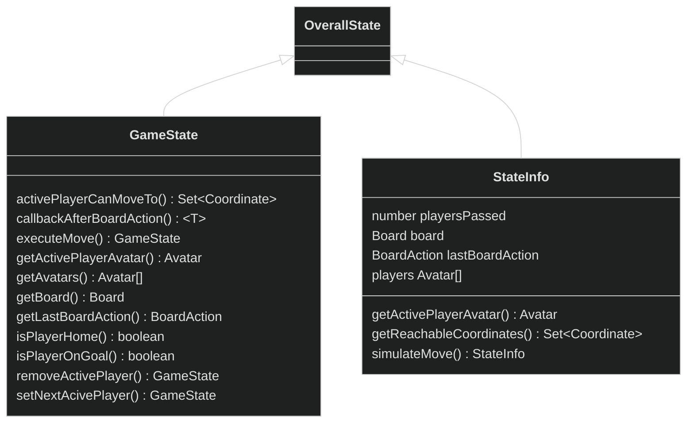
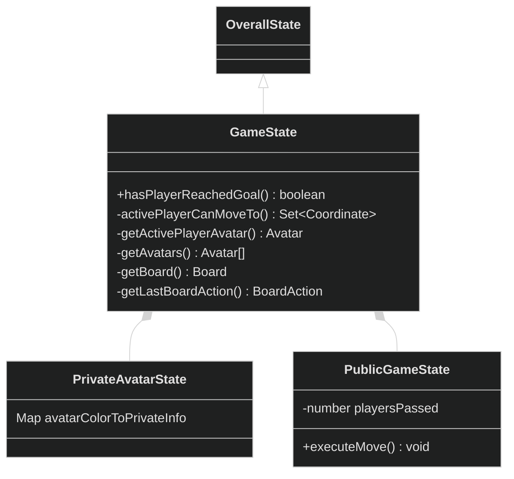
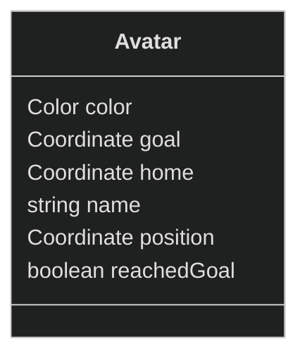
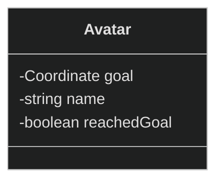
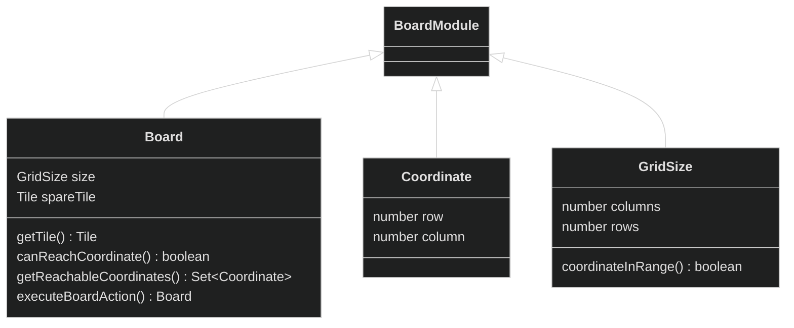
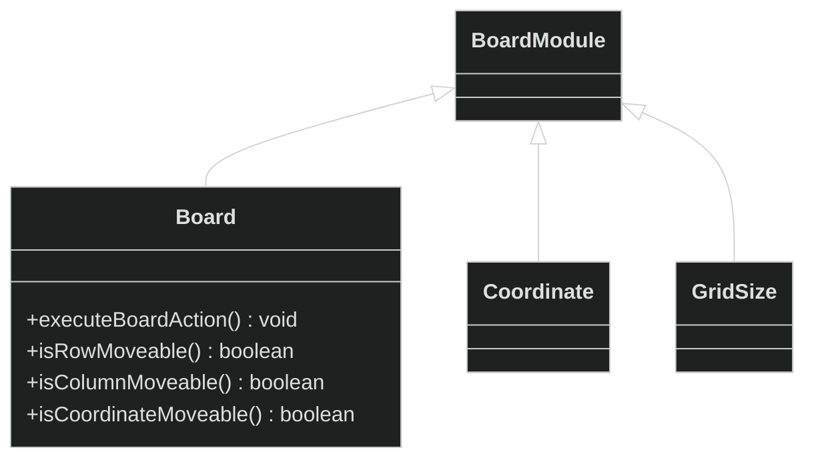
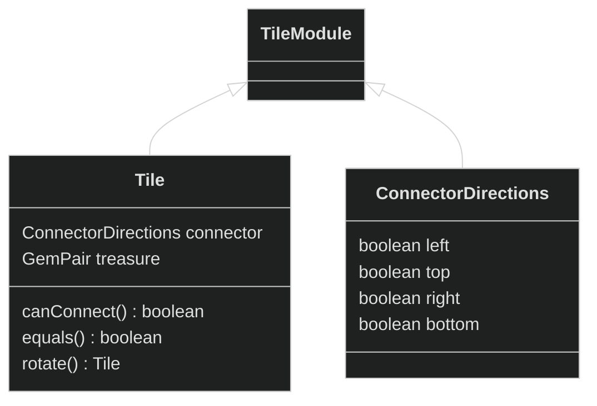
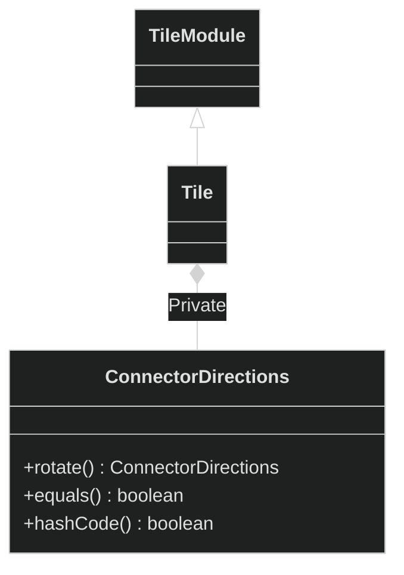

# Overview

The Maze game is based on the Labyrinth game. It takes place on a "maze" of pathways. Players must navigate these pathways, collect treasures, and return to their homes. 

# Remote
The `Server` will sign up `Client`s, and pass them to the `Referee` to run games. The `Referee` will not know about the remote nature of the `Client`s, nor will any of the logical components. To accomplish this, we make use of the remote proxy pattern. The `Client` will make us of the existing `Player` interface (and related components, such as the `Strategy`). The `Client` will connect to the `Server` to play a game.

# Playing a game

The player implements the functionality in the `Player` interface, and delegates turn-taking to a `Strategy`. The `Referee` takes a list of `Players`, and runs a game of Maze to completion. The `Referee` must be considerate of possible failures in `Player`s, as the `Player` mechanism and `Referee` may be produced by two different teams. 

# TAHBPL - Limitations
- Data structures (like `set`) compare by reference, not by equality 
  - Unable to override the `hash` function
  - Have to depend on external library for sets/maps of objects
- Using `Promise.race` to cancel function execution after `X` seconds
  - Couldn't find a library to do this
- JSON streaming - do top-level values need space delimiting?

# Milestone 9 — Revisions

# Original organization & desired changes

This is an overview of how our codebase was organized and composed prior to Milestone 9, and related challenges from that structure

## Systemic/overarching changes
- Transition to using mutable objects
  - We have serious performance concerns
    - This is almost certainly due to immutability – I've been unable to find any algorithmic issues or efficiency issues that could account for it
    - For reference, running 1000 rounds of a game (specifically, `6/Tests/0-in.json`) takes ~70 secs.
- Go through `test_utility`. Is there functionality here that would be better suited in component classes? Or in general `Utility`?

## Smaller changes
- `Rules`
  - `isActionLegal` should make use of the state's capability to make a move, call a callback, and undo that move

----

## "State"
"State" is quoted, because it refers to the concept of a game's state, not the `State` component

### Original

#### Concerns
- Parallel data
  - `GameState` and `StateInfo` maintain the same data and duplicate functionality. Not performant, and not robust
- "Active player"
  - Multiple functions claim to make a move on the active player (eg. `activePlayerCanMoveTo`), but take an optional argument for a player's `Color`
    - Refactor to remove optional args — the functions should only operate on the active player. If you want another player, you can rotate players via `setNextActivePlayer`
- Composition
  - `GameState` should compose `StateInfo`, so that functionality is not duplicated
    - `GameState` will include the private information about the state, such as player goals and if they've reached the goal yet
    - To ensure consistency between this `Color` -> private information mapping, `GameState` should contain an inner private class managing this. Impossible to query private information without running a check first!
  - `StateInfo` should be renamed to `PublicGameState` for consistency  
- `callbackAfterBoardAction` — Clarify naming. This method should try a BoardAction, run a callback and save the result, undo the BoardAction, and return the result of the callback
- `executeMove`, `setNextActivePlayer`, and `removeActivePlayer` should mutate the `GameState`
- rename `isPlayerHome` to `isPlayerOnHome`

### Desired state (diagram only shows diff)

-----

## Avatar
### Original

#### Concerns
- The `Avatar` contains a mix of public and private data, as well as parallel data

### Desired state (diagram only shows diff)
- An `Avatar` should only store public knowledge about a player's state in the game
  - Should replace `PlayerInfo`
  - All private information should be stored in the game "state"
- An `Avatar` should not have a `name` — it should always be gotten directly from the `Player`
- Rename to `PublicPlayerState`

-----
## Board
### Original
- A `Board` is a representation of a game board, consisting only of `Tile`s (ie. has no knowledge of players or their state)

#### Concerns
- A `Board` should have no concept of a "spare tile"
  - A `BoardAction` should have no concept of rotations
    - `executeBoardAction` should take a `BoardAction` and a `Tile`, and execute + insert that `Tile` without any rotation. Rotation should happen before
- `executeBoardAction` should mutate the current `Board`, not return a new one entirely

### Desired state (diagram only shows diff)
- **[Breaking change]** `spareTile` should be handled in the State
- **[Breaking change]** `executeBoardAction` should take a `Tile` to insert
  - **[Breaking change]** `BoardAction` should have no concept of rotations
- **[Breaking change]** `executeBoardAction` should mutate the calling `Board`
- `Board` should expose `isRowMoveable`, `isColumnMoveable`, and `isCoordinateMoveable`
  - This should be the one and only source of truth on the matter

-----

## Tile
### Original
- A `Tile` is a representation of a tile in our game
- A `ConnectorDirections` represents a `Connector` character, and the directions in which it is connected

#### Concerns
- There is no need for `ConnectorDirections` to be publically visible — it should be internal to `Tile`
  - Instead of associating a `Tile` with a `ConnectorDirections`, it should be associated with a `Connector`
- All `Tile.rotate` does is rotate the `ConnectorDirections` — therefore, Tile's rotate should use a `ConnectorDirections.rotate` method to do the work

### Desired state (diagram only shows diff)
- **[Breaking change]** Externally - a `Tile`'s connector is represented by a `Connector`
- `ConnectorDirections` is private to the `Tile` class
- `Tile` remains immutable
